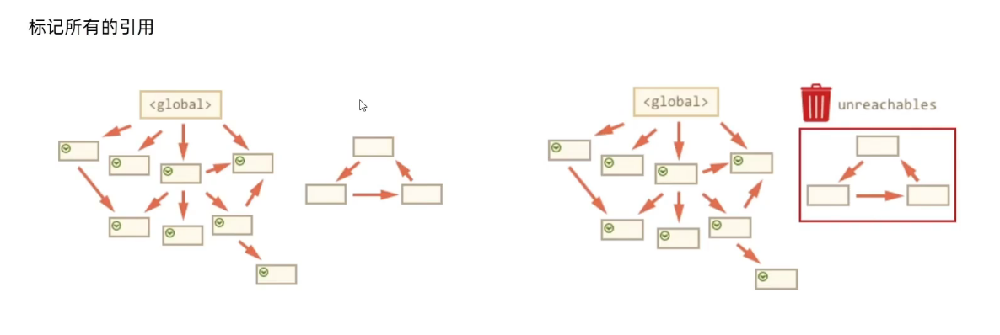

# learn_js_advanced

记录一些 js 进阶内容

## 作用域

规定了变量能够访问的“范围”，离开了这个“范围”变量便不能被访问

作用域分为：局部作用域和全局作用域

### 局部作用域

局部作用域分为函数作用域和块作用域。

**函数作用域**：在函数内部声明的变量只能在函数内部被访问，外部无法直接访问

```js
function getSum() {
  //函数内部是函数作用域，属于局部变量
  const num = 10;
}

console.log(num); //报错，函数外部不能使用局部作用域变量
```

总结：

1.函数内部声明的变量，在函数外部无法被访问

2.函数的参数也是函数内部的局部变量

3.不同函数内部声明的变量无法互相访问

4.函数执行官完毕后，函数内部的变量实际被清空了

**块作用域**：在 JS 中使用 {} 包裹的代码称为代码块，代码块内部声明的变量外部将（有可能）无法被访问

```js
for (let t = 1; t < 9; t++) {
  //t 只能在该代码块中被访问
  console.log(t);
}

//超出t 的作用域
console.log(t); //报错
```

总结：

1.let 声明的变量会产生块作用域，var 不会产生块作用域

2.const 声明的常量也会产生块作用域

3.不同代码块之间的变量无法互相访问

4.推荐使用 let 或 const

### 全局作用域

```
<script>  标签 和 .js 文件的 最外层 就是所谓的全局作用域，在此声明的变量在函数内部也可以被访问。
```

全局作用域中声明的变量，任何其他作用域都可以被访问

注意：

1.为 window 对象动态添加的属性默认也是全局的，不推荐！

2.函数中未使用任何关键字声明的变量为全局变量，不推荐！

3.尽可能少的声明全局变量，防止全局变量被污染


```js
//全局作用域
let a = 1;
let b = 2;

//局部作用域
function f() {
  let a = 1;
  function g() {
    a = 2;
    console.log(a);
  }

  g();
}

f();   // 2
```


### 作用域链

作用域链本质上是底层的变量查找机制

1.在函数被执行时，会优先查找当前函数作用域中查找变量

2.如果当前作用域查不到则会依次逐级查找父级作用域直到全局作用域


总结：

1.嵌套关系的作用域串联起来形成了作用域链

2.相同作用域链中按着从小到大的规则查找变量

3.子作用域能够访问父作用域，父级作用域无法访问子级作用域


## JS 垃圾回收机制

垃圾回收机制（Garbage Collection）简称 GC

JS中内存的分配和回收都是自动完成的，内存在不使用的时候会被垃圾回收器自动回收


### **内存的生命周期**

JS环境中分配的内存，一般有如下生命周期：

1.**内存分配**：当我们声明变量、函数、对象的时候，系统会自动为他们分配内存

2.**内存使用**：即读写内存，也就是使用变量、函数等

3.**内存回收**：使用完毕，由垃圾回收器自动回收不在使用的内存


**说明**：

全局变量一般不会回收（关闭页面回收）

一般情况下局部变量的值，不用了，会被自动回收掉


**内存泄漏**：程序中分配的内存由于某种原因程序未释放或无法释放叫做内存泄漏


### 算法说明

堆栈空间分配区别：

1.栈（操作系统）：由操作系统自动分配释放函数的参数值、局部变量等，基本数据类型放到栈里

2.堆（操作系统）：一般由程序员分配释放，若程序员不释放，由垃圾回收机制回收。复杂数据类型放到堆里。


常见的浏览器垃圾回收算法：**引用计数法** 和 **标记清除法**


#### 引用计数法

IE采用的引用计数算法，定义“内存不再使用”，就是看一个对象是否有指向它的引用，没有引用了就回收对象。

算法：

1.跟踪记录被引用的次数

2.如果被引用了一次，那么就记录次数1，多次引用会累加 ++

3.如果减少一个引用就减1 --

4.如果引用次数是0，则释放内存


引用计数存在一个致命问题：嵌套引用（循环引用）

如果两个对象相互引用，尽管他们已不再使用，垃圾回收器不会进行回收，导致内存泄漏。

```js
function fn() {
  let o1 = {};
  let o2 = {};

  o1.a = o2;
  o2.a = o1;
  return;
}

fn(); 
```

因为他们的引用次数永远不会是0。这样的相互引用如果说很大量的存在就会导致大量的内存泄露。


#### 标记清除法

核心：

1.标记清除算法将“不再使用的对象”定义为“无法达到的对象”

2.就是从根部（在JS中就是全局对象）出发定时扫描内存中的对象。凡是能从根部到达的对象，都是还需要使用的

3.那些无法由根部出发触及到的对象被标记为不再使用，稍后进行回收。




## 闭包

一个函数对周围状态的引用捆绑在一起，内层函数中访问到其外层函数的作用域

简单理解： 闭包 = 内层函数 + 外层函数的变量

```js
function outer() {
  let a = 0;
  function fn() {
    a++;
    console.log(a);
    return a
  }
  return fn;
}

let foo = outer();
foo();
foo();
```

闭包的应用：实现数据的私有

比如，我们做个统计函数调用次数，函数调用一次，就++


## 变量提升

变量提升是 JavaScript中比较“奇怪”的现象，它允许在变量声明之前即被访问（仅存在于var声明变量）

注意：

1.变量在未声明即被访问时会报语法错误

2.变量在var声明之前即被访问，变量的值为 undefined

3.let / const 声明的变量不存在变量提升

4.变量提升出现在相同作用域中

5.实际开发中推荐先声明再访问变量


```js
console.log(num); // undefined
var num = 10; 

// 相当于
/*
  var num;
  console.log(num);
  num = 10;
*/
```

1. 把所有var声明的变量提升到 当前作用域的最前面

2. 只提升声明，不提升赋值


## 函数提升

函数提升与变量比较类似，是指函数在声明之前即被调用

```js
/*
 1.会把所有函数声明提升到当前作用域的最前面
 2.只提升函数声明，不提升函数调用
*/

fn();
//声明函数
function fn() {
  console.log("函数提升");
}

// fun(); // 报错
// var fun = function () {
//   console.log("函数表达式");
// };

// 函数表达式 必须先声明和赋值，后调用 否则报错
```

总结：

1.函数提升能够使函数的声明调用更灵活

2.函数表达式不存在提升的现象

3.函数提升出现在相同作用域当中


## 函数参数

产品需求：写一个求和函数，不管用户传入几个实参，都要把和求出来

### 动态参数

arguments 是函数内部内置的伪数组变量，它包含了调用函数时传入的所有实参

```js
// 计算所有函数的和
function sum() {
  let s = 0;
  for (let i = 0; i < arguments.length; i++) {
    s += arguments[i];
  }
  console.log(s);
}

sum(5, 10);

sum(5, 10, 15);
```

总结：

1.arguments 是一个伪数组，只存在于函数中

2.arguments  的作用是动态获取函数的实参

3.可以通过for循环依次得到传递过来的实参


### 剩余参数

- ... 是语法符号，置于最末函数形参之前，用于获取多余的实参
- 借助 ... 获取的剩余实参，是个真数组

```js
function sum(...rest) {
  let s = 0;
  for (let i = 0; i < rest.length; i++) {
    s += rest[i];
  }
  console.log(s);
}

sum(1, 2);
sum(1, 2, 3);
```

开发中，更提倡  剩余参数


## 展开运算符

展开运算符（ ... ),将一个数据进行展开

```js
const arr = [1, 2, 3];
//展开运算符，可以展开数组
console.log(...arr); // 1 2 3
```

说明：

1.不会修改原数组


典型运用场景：求数组最大值（最小值）、合并数组等

```js
const arr1 = [1, 2, 3];
//展开运算符，可以展开数组
console.log(...arr1); // 1 2 3

//使用场景
console.log(Math.max(...arr1));

const arr2 = [4, 5, 6];
//合并arr1  arr2
const newArr = [...arr1, ...arr2];
console.log("newArr", newArr);
```


## 箭头函数

引入箭头函数的目的是更简短的函数写法并且不绑定this，箭头函数的语法比函数表达式更简洁

箭头函数更适用于那些本来需要匿名函数的地方

### 基本语法

```js
//1.箭头函数
const fn1 = (x) => {
  console.log(x);
};

//2.只有一个形参的时候，可以省略小括号
const fn2 = (x) => {
  console.log(x);
};

//3.只有一行代码的时候，我们可以省略大括号
const fn3 = (x) => console.log(x);

//4.只有一行代码的时候，可以省略return
const fn4 = (x) => x + x;

//5.箭头函数可以直接返回一个对象
const fn5 = (uname) => ({ uname });
```


1.箭头函数属于表达式函数，因此不存在函数提升

2.箭头函数只有一个参数时可以省略圆括号（）

3.箭头函数函数体只有一行代码时可以省略花括号{}，并自动作为返回值被返回

4.加括号的函数体返回对象字面量表达式


### 参数

1.普通函数有arguments 动态参数

2.箭头函数没有arguments 动态参数，但是有剩余参数 ...args


### 箭头函数this

箭头函数不会创建自己的this，它只会从自己的作用域链的上一层沿用this

```html
<!DOCTYPE html>
<html lang="en">
<head>
  <meta charset="UTF-8">
  <meta name="viewport" content="width=device-width, initial-scale=1.0">
  <title>Document</title>
</head>
<body>
  <script>
    // 以前this的指向：谁调用的这个函数，this 就指向谁
    console.log(this); // window
    //普通函数
    function fn() {
      console.log("fn",this); // window
    }
    fn();


    const obj = {
      name:'Nash',
      sayHi:function(){
      console.log("sayHi",this)
      }
    }
    obj.sayHi() // obj


    // 箭头函数的this

    const foo  = ()=>{
      console.log("foo",this);  // window
    }
    foo()


    const obj1 = {
      name:'Nash',
      sayHi1:()=>{
        console.log("sayHi1",this) // window
      },
      sayHi2:function(){
        let i = 10
        const count = ()=>{
          console.log('sayHi2',this); //obj1
        }
        count()
      }
    }

    // 对象方法箭头函数 this
    obj1.sayHi1()
    obj1.sayHi2()
  </script>
</body>
</html>
```


DOM事件回调函数为了简便，还是不太推荐使用箭头函数


## 解构赋值


### 数组解构

数组解构是将数组的单元值快速批量赋值给一系列变量的简洁语法。


基本语法：

1.赋值运算符 = 左侧的 [] 用于批量声明变量，右侧数组的单元值将被赋值给左侧的变量

2.变量的顺序对应数组单元值的位置一次进行赋值操作

```go
const arr = [100, 60, 80];

const [max, min, avg] = arr;

console.log("max", max);
console.log("min", min);
console.log("avg", avg);
```


```js
// 变量多，单元值少 ,undefined
const [a, b, c, d] = [1, 2, 3];
console.log("a", a); //1
console.log("b", b); //2
console.log("c", c); //3
console.log("d", d); //undefined
```

```js
// 变量少，单元值多
const [a, b, c] = [1, 2, 3, 4];
console.log("a", a); //1
console.log("b", b); //2
console.log("c", c); //3
```

```js
// 剩余参数 变量少，单元值多
const [a, b, ...c] = [1, 2, 3, 4];
console.log("a", a); //1
console.log("b", b); //2
console.log("c", c); //[3,4]
```

```js
// 给默认值 防止 undefined 传递
const [a = 0, b = 0, c = 0] = [1, 2];
console.log("a", a); //1
console.log("b", b); //2
console.log("c", c); //0
```

```js
// 按需导入数值
const [a, b, , d] = [1, 2, 3, 4];
console.log("a", a); //1
console.log("b", b); //2
console.log("d", d); //4
```

```js
// 多维数组解构
const [a, b, [c]] = [1, 2, [3, 4]];
console.log("a", a); //1
console.log("b", b); //2
console.log("c", c); //3
```


应用：交换变量

```js
//交换变量
let a = 1;
let b = 2;
[b, a] = [a, b];
console.log("a", a);
console.log("b", b);
```


### 对象解构

对象解构是将对象属性和方法快速批量赋值给一系列变量的简洁语法

基本语法：

1.赋值运算符 = 左侧的 {} 用于批量声明变量，右侧对象的属性值将被赋值给左侧的变量

2.对象属性的值将被赋值给与属性名相同的变量

3.注意解构的变量名不要和外面的变量名冲突 否则报错

4.对象中找不到与变量名一致的属性时变量值为 undefined


```js
const obj = {
  uname: "Nash",
  age: "18",
};

const { uname, age } = obj;

//修改解构的属性名
const { uname: username, age: userage } = obj;

//数组对象解构
const obj1 = [
  {
    uname: "Bob",
    age: "20",
  },
];

const [{ uname: obj1uname, age: obj1age }] = obj1;


//多级对象解构
const student = {
  name: "Mike",
  score: {
    math: 80,
    english: 90,
  },
};

const {
  score: { math },
} = student;

```


## 基本包装类型

在JS中最主要的数据类型有6种

基本数据类型：string，number，boolean，undefined，null

应用类型：Object

但是，，我们会发现有些特殊情况：

```js
//普通字符串
const str = "Nash";
console.log(str.length);
```

其实字符串、数值、布尔等基本类型也有专门的构造函数，这些我们称为包装类型。

JS中几乎所有的数据都可以基于构造函数创建


## 对象

### 创建对象三种方式

```js
// 1.利用对象字面量创建对象
const obj1 = {
  name: "Nash",
};

// 2.利用 new Object 创建对象
const obj2 = new Object({ name: "Nash" });

// 3.利用构造函数创建对象
// 构造函数：是一种特殊的函数，主要用来初始化对象

function Pig(name, age, gender) {
  this.name = name;
  this.age = age;
  this.gender = gender;
}

const Peppa = new Pig("Peppa", 6, "女");

console.log("Peppa", Peppa);
```

说明：

1.使用new关键字调用函数的行为被称为实例化

2.实例化构造函数时没有参数时可以省略（）

3.构造函数内部无需写return，返回值即为新创建的对象

4.构造函数内部无需写return 返回的值无效，所以不要写return

5.new Object()  new Date() 也是实例化构造函数


### new实例化过程

1.创建空对象

2.构造函数this指向新对象

3.执行构造函数代码，修改this，添加新的属性

4.返回新对象


### 实例成员&静态成员

#### 实例成员

实例成员：通过构造函数创建的对象称为实例对象，实例对象中的属性和方法称为实例成员（实例属性和实例方法）

说明：

1.为构造函数传入参数，创建结构相同但值不同的对象

2.构造函数创建的实例对象彼此独立互补影响


#### 静态成员

静态成员：构造函数的属性和方法被称为静态成员（静态属性和静态方法）

说明：

1.静态成员只能构造函数来访问

2.静态方法中的this指向构造函数


## 原型

构造函数通过原型分配的函数是所有对象所共享的

JS规定，每一个构造函数都有一个prototype属性，指向另一个对象，所以我们也称为原型对象

这个对象可以挂载函数，对象实例化不会多次创建原型上函数，节约内存

我们可以把那些不变的方法，直接定义在prototype对象上，这样所有对象的实例就可以共享这些方法

构造函数和原型对象中的this都指向实例化的对象


## 构造函数 constructor

每个原型对象里面都有 constructor 属性，该属性指向原型对象的构造函数。

```js
function Star(uname, age) {
  that = this;

  this.uname = uname;
  this.age = age;
}
Star.prototype.sing = function () {
  console.log("唱歌");
};

// 还可以让 prototype 等于一个新对象 来增加方法，但是会导致丢失构造函数，要重新指回
Star.prototype = {
  constructor: Star, //指回
  sing: function () {
    console.log("唱歌");
  },
  dance: function () {
    console.log("跳舞");
  },
};
```

